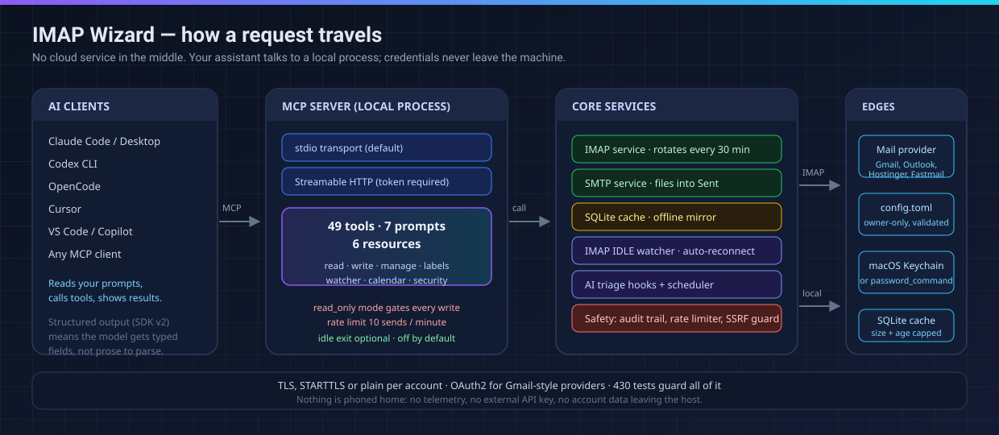
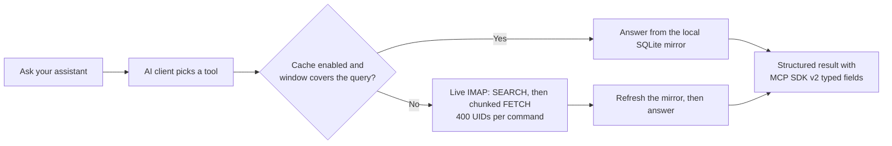
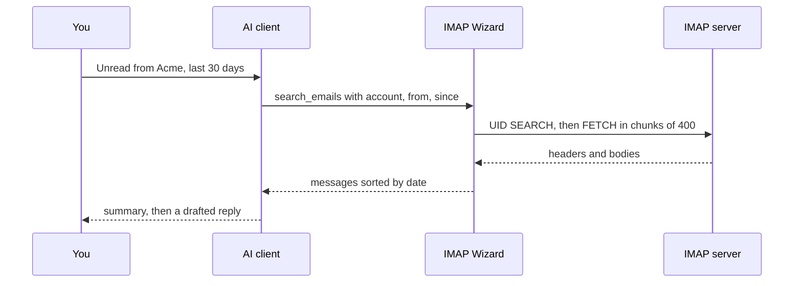

<div align="center">

# IMAP Wizard


**The email server your AI assistant actually needs.** A hardened fork of
[codefuturist/email-mcp](https://github.com/codefuturist/email-mcp) — every known
bug fixed, 13 security controls added, released and versioned.

[](https://github.com/Fe2-O3/email-mcp/releases/tag/v0.1.0)
[](https://github.com/codefuturist/email-mcp/releases)
[](CHANGELOG.md)
[](#49-tools)
[](https://github.com/Fe2-O3/email-mcp/commits/main)
[](#version-history)
[](LICENSE)
[](https://modelcontextprotocol.io)
[](https://nodejs.org)
[](https://typescriptlang.org)
[](CONTRIBUTING.md)

<table>
  <tr>
    <td align="center"><h3>49</h3><sub>tools</sub></td>
    <td align="center"><h3>7</h3><sub>prompts</sub></td>
    <td align="center"><h3>6</h3><sub>resources</sub></td>
    <td align="center"><h3>428</h3><sub>tests green</sub></td>
    <td align="center"><h3>92</h3><sub>commits</sub></td>
    <td align="center"><h3>17</h3><sub>upstream issues closed</sub></td>
  </tr>
</table>

<a href="#what-you-can-ask-for">What you can ask for</a> ·
<a href="#why-this-fork">Why this fork</a> ·
<a href="#architecture-at-a-glance">Architecture</a> ·
<a href="#version-history">Version history</a> ·
<a href="#quick-start">Quick start</a> ·
<a href="#whats-fixed">Bug fixes</a> ·
<a href="#49-tools">Tools</a> ·
<a href="#configuration">Config</a> ·
<a href="#faq">FAQ</a> ·
<a href="#security">Security</a>

</div>

---

## What You Can Ask For

Plain sentences in, real mail operations out. The assistant picks the tool; you
never see IMAP.

| Say this | What runs |
|---|---|
| "Any invoice from Acme this month? Save the PDF to `~/Documents/Acme`" | `search_emails` → `get_email` → `download_attachment` with `savePath` |
| "Reply to Sarah: Thursday works, cc billing" | `reply_email` (honours Reply-To and cc) |
| "What's unread and older than a week?" | `list_emails` sorted by **date**, not UID |
| "Is this sender legit? Check the headers" | `get_email_security` (DMARC / SPF / DKIM) |
| "Summarize my inbox for standup, skip the bulk mail" | prompts + `list_emails` + bulk-mail flags from headers |
| "Label everything unread from my manager as Follow-ups" | `add_label`, optionally driven by the watcher |
| "Delete last month's newsletters" | `bulk_action` behind the rate limiter and audit trail |
| "Find the reply, save a draft, and send nothing" | `read_only` mode refuses every write |

Every call is one of the [49 tools](#49-tools). Every write is rate-limited,
audited, and filed into Sent.

---

## Why This Fork

The upstream project is good, active, and now at **v0.5.1** — but its open
issues describe bugs that break real-world usage, and **every issue below was
verified still open after v0.5.1**. This fork fixes them all, hardens the
security surface, and ships its own release.

| | Upstream (v0.5.1) | This fork (v0.1.0) |
|---|:---:|:---:|
| **Sent mail saved** | ❌ Never ([#20](https://github.com/codefuturist/email-mcp/issues/20)) | ✅ IMAP APPEND |
| **Attachments on send** | ❌ ([#52](https://github.com/codefuturist/email-mcp/issues/52)) | ✅ Forward, send, draft |
| **Save to disk** | ❌ Base64 only ([#12](https://github.com/codefuturist/email-mcp/issues/12)) | ✅ `savePath` param |
| **llama.cpp compatible** | ❌ Schema crashes ([#58](https://github.com/codefuturist/email-mcp/issues/58)) | ✅ GBNF-safe |
| **Date ordering** | ❌ UID-based ([#59](https://github.com/codefuturist/email-mcp/issues/59)) | ✅ Sort by date |
| **Multipart bodies** | ❌ Raw MIME ([#66](https://github.com/codefuturist/email-mcp/issues/66)) | ✅ Decoded, richer text |
| **Stdio orphan fix** | ❌ ([#60](https://github.com/codefuturist/email-mcp/issues/60)) | ✅ Clean exit + 30-min idle exit |
| **Duplicate send guard** | ❌ ([#62](https://github.com/codefuturist/email-mcp/issues/62)) | ✅ Identifiable retries |
| **Memory leak (6 days)** | ❌ OOM ([#55](https://github.com/codefuturist/email-mcp/issues/55)) | ✅ Connection rotation |
| **Private IP SSRF** | ❌ | ✅ Blocked |
| **Keychain support** | ❌ Plain text | ✅ macOS Keychain |
| **Large mailboxes (64k+)** | ❌ UID-join overflows | ✅ Chunked UID fetches |
| **IP-literal IMAP hosts** | ✅ Fixed in v0.5.1 | ✅ Ported (`70d4215`) |
| **`config validate`** | ✅ New in v0.5.0 | ✅ Ported (`bf09dcc`) |

<div align="center">

| <strong>Bug fixes</strong> | <strong>Security</strong> | <strong>Craft</strong> |
|:---:|:---:|:---:|
| 17 upstream issues closed, every fix linked | 13 hardening controls, disclosure policy | 428 tests, CI-grade <code>config validate</code> |

</div>

---

## Architecture at a Glance



Everything runs on your machine. There is no proxy, no telemetry, and no API key
to buy: your assistant drives a local process that speaks IMAP and SMTP straight
to your provider.





Why each piece is there:

- **stdio by default, HTTP on request** — the pipe dies with your client; HTTP
  mode still demands a token, even on loopback.
- **Chunked UID fetches** (400 per command) — a full-mailbox UID list overflows
  the server's argument limit. Verified on a 64,779-message mailbox.
- **SQLite mirror with caps** (`window_days`, `max_size_mb`) — repeat questions
  never touch the network.
- **Connections rotate every 30 minutes** — closes the six-day leak
  ([#55](https://github.com/codefuturist/email-mcp/issues/55)).
- **30-minute idle exit** — a host that never closes the pipe cannot pin an
  orphan ([#60](https://github.com/codefuturist/email-mcp/issues/60)).
- **Keychain or `password_command`** — no plaintext secrets at rest.

---

## Version history

Two release lines share one codebase. Upstream's history is preserved here and
linked; this fork starts its own at **v0.1.0**.

| Date | Upstream — [codefuturist/email-mcp](https://github.com/codefuturist/email-mcp/releases) | This fork — [Fe2-O3/email-mcp](https://github.com/Fe2-O3/email-mcp/releases) |
|---|---|---|
| 2026-02-18 | [v0.2.0](https://github.com/codefuturist/email-mcp/releases/tag/v0.2.0) | — |
| 2026-02-20 | [v0.2.1](https://github.com/codefuturist/email-mcp/releases/tag/v0.2.1) | — |
| 2026-08-21 | — (main at `7fe8916`, v0.2.1-14) | **Fork point** — repair work begins |
| 2026-08-20 → 09-27 | — | 80+ commits: 17 issue fixes, 13 security controls, MCP SDK v2, UID chunking, idle exit |
| 2026-09-26 | **One-day release train:** [v0.4.0](https://github.com/codefuturist/email-mcp/releases/tag/v0.4.0) → [v0.4.1](https://github.com/codefuturist/email-mcp/releases/tag/v0.4.1) → [v0.5.0](https://github.com/codefuturist/email-mcp/releases/tag/v0.5.0) → [v0.5.1](https://github.com/codefuturist/email-mcp/releases/tag/v0.5.1) — verification-code catcher, `config validate`, daemon lifecycle, CLI 3.8×, bun binaries, TLS servername fix | — |
| 2026-09-28 | — | **[v0.1.0](https://github.com/Fe2-O3/email-mcp/releases/tag/v0.1.0)** — first release: everything above, plus three ports from upstream v0.5.1 (below). Full detail in the [CHANGELOG](CHANGELOG.md). |

**Bug fixes from codefuturist's tracker:** the [What's Fixed](#whats-fixed)
section links every upstream issue each fix resolves — straight to
[codefuturist/email-mcp/issues](https://github.com/codefuturist/email-mcp/issues).

### Ported from upstream v0.5.1

Three wins from upstream's September releases were adopted in v0.1.0 instead of
being left as gaps. Full adoption analysis lives in
[draft: upstream v0.5 features](docs/upstream-v0.5-draft.md).

<details>
<summary><strong>Why IP-literal IMAP hosts failed</strong> (ported from upstream <code>70d4215</code>) — and what fixed it</summary>

<br>

Connecting to an IMAP server by IP address (`host = "203.0.113.7"`) died
before authentication, with an error that never named the cause:

```text
host is an IP literal
        ↓
imapflow's constructor sets servername = false   (its SNI fallback for IPs)
        ↓
node: tls.connect({ servername: false })         ← rejects non-string servername
        ↓
"Connection error" before the server ever speaks
```

The repair cannot live in a patch file — pnpm patches never reach every install
shape. So all three IMAP construction sites (connection manager ×2, watcher)
now build clients through `createImapClient()`, which normalizes `servername`
to `undefined` right after construction. Unit tests pin the behavior. Drop the
shim when imapflow ships its own fix.

</details>

<details>
<summary><strong><code>config validate</code></strong> (ported from upstream <code>bf09dcc</code>)</summary>

<br>

```bash
node dist/main.js config validate
```

Walks your `config.toml` against the live zod schema tree:

- **TOML syntax** — parse errors name the line
- **Schema** — every account and settings section checked
- **Typos** — unknown keys get did-you-mean suggestions
  (`settings.hooks.auto_labek — did you mean "auto_label"?`)
- **Consistency** — hooks active with the watcher off, empty watcher folders,
  duplicate account names

Warnings don't fail the run; errors exit `1` (CI-friendly). Live connection
checks stay in `email-mcp test`.

</details>

<details>
<summary><strong>Dependency set aligned with upstream v0.5.1</strong> (upstream <code>bae1bb7</code>)</summary>

<br>

| Package | Before | Now |
|---|---|---|
| `imapflow` | 1.7 | **2.0.8** |
| `nodemailer` | 9 | **10** |
| `vitest` | 4 | **5** |
| `zod` | 4.4 | **4.6** |
| `@clack/prompts` | 1.7 | **1.8** |
| MCP SDK / server / node | 1.26 / 2.0 / 2.0 | **1.30 / 2.1 / 2.1** |

Type adaptations rode along: imapflow 2's `status()` can return `false`,
`download()` can return no content, nodemailer 10 dropped the
`nodemailer.TransportOptions` namespace, clack 1.8's cancel sentinel became a
`unique symbol`. All 428 tests green on the new set.

</details>

---

### Upstream features, and this fork's call on each

Upstream shipped a lot more in the same week. Porting is a per-feature decision
with credit attached, never a blind merge; the full draft with commit references
is [docs/upstream-v0.5-draft.md](docs/upstream-v0.5-draft.md).

| Upstream v0.4 / v0.5 feature | This fork | Reasoning |
|---|---|---|
| TLS `servername` repair for IP-literal hosts | **Ported** (`70d4215`) | Real bug here too: IMAP hosts given as IP addresses failed before authentication |
| `config validate` with did-you-mean typos | **Ported** (`bf09dcc`) | Same silent-typo failure mode; exit `1` keeps it usable in CI |
| Dependency set: imapflow 2, nodemailer 10, vitest 5, zod 4.6 | **Ported** (`bae1bb7`) | One upgrade pass instead of a growing backlog |
| CLI lazy-loading, 3.8× faster startup (`a0f9ca6`) | **Adopt next** | Pure refactor of `main.ts`. Only real risk is a missed import, and 428 tests would catch it |
| Shell completion for zsh, bash, fish (`e0c6563`) | **Adopt next** | Additive and small. Ours must list *our* subcommands, including `config validate`, so the list needs a test to stay honest |
| Config section editor, field catalog, validated save with backups | **Hold** | `config validate` already delivers the safety non-interactively. Their field catalog assumes `server` and `verification` sections this fork does not have, and does not know our `keychain`, `idle_exit`, or `password_command` settings |
| Verification-code catcher: OTP, magic links, clipboard (12 commits) | **Not adopted** | Upstream ships it **on by default** (`enabled: true`, `auto_copy: true`, `confirm_copy: false`) and its clipboard service reads your clipboard with `pbpaste`. Useful, but it puts clipboard access inside a mail server, and this fork does not need it |
| `[settings.server]` daemon plus launchd login item | **Not adopted** | `http` already works when you want it. A login-item daemon is another supervisor to trust, and it overlaps the idle-exit valve |
| Bun single binaries, GoReleaser Pro matrix, npm and Docker publish | **Not adopted** | Their release pipeline publishes to upstream's registries, and their workflows were removed from this repo for that reason. This fork ships tagged source releases verified by its own CI |

---

## Quick Start

### 1. Build

Requires Node.js ≥ 24 and pnpm.

```bash
git clone https://github.com/Fe2-O3/email-mcp.git
cd email-mcp
pnpm install && pnpm build
```

### 2. Add an account

```bash
node dist/main.js account add
```

The wizard auto-detects your email provider (Gmail, Outlook, Yahoo, iCloud,
Hostinger, Fastmail, ProtonMail, Zoho, GMX) and configures IMAP/SMTP settings.

### 3. Test

```bash
node dist/main.js test
```

### 3b. If it fails, check these three first

- **Setup says invalid file:** run `node dist/main.js config validate` first —
  it names the exact line and key. Then check the path from
  `node dist/main.js config path`, fix the named line, run `test` again.
- **Search looks wrong:** `list_emails` and `search_emails` sort by date now.
  Pass `sort: uid` only when you need old order.
- **Send looks lost:** sent mail files into Sent by itself. Check Sent for the
  same message ID before you resend.

### 3c. Know the limits before you file a bug

| Symptom | Why it happens | What to do |
|---|---|---|
| `MCP error -32001: Request timed out` | Your client cut the call at 60 s. A full-text search over 64k messages measured ~80 s | Raise the timeout — `180000` in OpenCode; no such cut-off in Claude Code |
| Setup reports an invalid config file | `config.toml` has a syntax or key error | `node dist/main.js config validate` names the line and the key |
| Search returns nothing on a small mailbox | Some servers answer SEARCH with garbage | This build fails loudly instead of reporting zero results |
| Login says only "Command failed" | You are on an older build | This build surfaces the server's own reason |
| A server process is still running | Your client holds the pipe open forever | `settings.idle_exit` (default 1800 s), or close the client cleanly |

### 4. Connect your AI client

<details>
<summary><strong>Claude Desktop</strong></summary>

Edit `~/Library/Application Support/Claude/claude_desktop_config.json`:

```json
{
  "mcpServers": {
    "email": {
      "command": "node",
      "args": ["/absolute/path/to/email-mcp/dist/main.js", "stdio"]
    }
  }
}
```
</details>

<details>
<summary><strong>Claude Code</strong></summary>

```bash
claude mcp add email -- node /absolute/path/to/email-mcp/dist/main.js stdio
```
</details>

<details>
<summary><strong>Cursor</strong></summary>

Edit `~/.cursor/mcp.json`:

```json
{
  "mcpServers": {
    "email": {
      "command": "node",
      "args": ["/absolute/path/to/email-mcp/dist/main.js", "stdio"]
    }
  }
}
```
</details>

<details>
<summary><strong>VS Code (GitHub Copilot)</strong></summary>

Add to `settings.json`:

```json
{
  "mcp": {
    "servers": {
      "email": {
        "type": "stdio",
        "command": "node",
        "args": ["/absolute/path/to/email-mcp/dist/main.js", "stdio"]
      }
    }
  }
}
```
</details>

<details>
<summary><strong>Codex</strong></summary>

Add to `~/.codex/config.toml`:

```toml
[mcp_servers.email]
command = "node"
args = ["/absolute/path/to/email-mcp/dist/main.js", "stdio"]
```
</details>

<details>
<summary><strong>OpenCode</strong></summary>

Add to `~/.config/opencode/opencode.json`, and raise the timeout: a full-text
search over a large mailbox can take longer than the 60-second default
(Hostinger measured ~80 seconds across 64k messages), and the default cut-off
surfaces as `MCP error -32001: Request timed out`:

```json
{
  "mcp": {
    "email": {
      "type": "local",
      "command": ["node", "/absolute/path/to/email-mcp/dist/main.js", "stdio"],
      "enabled": true,
      "timeout": 180000
    }
  }
}
```
</details>

<details>
<summary><strong>Streamable HTTP (networked)</strong></summary>

```bash
node dist/main.js http --port 8080
```

Then configure your client:

```json
{
  "mcpServers": {
    "email": {
      "type": "streamable-http",
      "url": "http://127.0.0.1:8080/mcp"
    }
  }
}
```
</details>

---

## What's Fixed

Every fix links the upstream issue it resolves — all of them were **still open
after upstream's v0.5.1 release**. Live tracker:
[codefuturist/email-mcp/issues](https://github.com/codefuturist/email-mcp/issues).

### Critical Bugs

| Issue | Problem | Fix |
|---|---|---|
| [#12](https://github.com/codefuturist/email-mcp/issues/12) | `download_attachment` returns base64, no disk save | Added `savePath` parameter — writes file to disk, returns path + size + sha256 |
| [#20](https://github.com/codefuturist/email-mcp/issues/20) [#54](https://github.com/codefuturist/email-mcp/issues/54) [#92](https://github.com/codefuturist/email-mcp/issues/92) | Sent mail never saved to Sent folder | Files sent messages into Sent via IMAP APPEND after SMTP send |
| [#45](https://github.com/codefuturist/email-mcp/issues/45) | `forward_email` ignores html flag | Honours the html flag on forward_email |
| [#52](https://github.com/codefuturist/email-mcp/issues/52) | send_email / send_draft do not support attachments | Attachments on forward, send, and draft paths |
| [#57](https://github.com/codefuturist/email-mcp/issues/57) | Unhandled error event crashes process on socket timeout | Attach error/close handlers to every ImapFlow client |
| [#58](https://github.com/codefuturist/email-mcp/issues/58) | Every tool call fails on llama.cpp models | Drop lookahead regex from recipient validation (GBNF-safe schemas) |
| [#59](https://github.com/codefuturist/email-mcp/issues/59) | Ordering by UID instead of date | Order list_emails and search_emails by date across the whole match set |
| [#60](https://github.com/codefuturist/email-mcp/issues/60) | stdio server never exits when client closes stdin (232 orphaned processes) | Exit stdio server when the client closes stdin; plus **30-minute idle exit** for hosts that never close the pipe |
| [#62](https://github.com/codefuturist/email-mcp/issues/62) | send_email retried call indistinguishable from new email | Make retried sends identifiable and refuse accidental duplicates |
| [#66](https://github.com/codefuturist/email-mcp/issues/66) [#95](https://github.com/codefuturist/email-mcp/issues/95) | get_email returns raw MIME / misses real body | Decode message bodies; fetch both halves of multipart/alternative and prefer the richer text |
| [#71](https://github.com/codefuturist/email-mcp/issues/71) [#91](https://github.com/codefuturist/email-mcp/issues/91) | Search returns zero results on broken IMAP4rev2 (Strato) | Fail loudly when a server's SEARCH answers with garbage |
| [#96](https://github.com/codefuturist/email-mcp/issues/96) | Non-ASCII characters in save_draft subject not RFC 2047 encoded | Build drafts via MailComposer to encode headers and body |
| [#79](https://github.com/codefuturist/email-mcp/issues/79) | read_only does not gate background services | Keep calendar writes behind readOnly gate |
| [#55](https://github.com/codefuturist/email-mcp/issues/55) | Memory leak in long-running process (OOM after 6 days) | Connection rotation (30min) + cache eviction (5min TTL) |
| — | `list_emails` / `search_emails` rejected every row by output schema | Include `messageId` in list schema and lock schema to domain type |
| — | Full-set UID fetches overflow server argument limits (64k mailboxes) | Chunk UID lists at 400 per command — verified on a 64,779-message mailbox |
| — | Login failures showed only "Command failed" | Surface IMAP `responseText` so the auth reason is visible |
| — | Broken setup file reported as "no configuration found" | Report the file as invalid with the reason instead of starting first-time setup |
| — | IMAP STARTTLS setting never reached the client | Apply STARTTLS to IMAP and offer TLS, STARTTLS, and plain as three choices |
| — | Watcher never signed in OAuth2 accounts | Sign the watcher in through the OAuth service |
| — | `send_draft` dropped every hidden copy recipient | Send hidden copy recipients when sending a saved draft |
| — | Same-name attachments overwrote each other | Save by occurrence, keep both files, report failures |
| — | `reply_email` ignored Reply-To | Reply to Reply-To when present |
| — | Calendar duplicate check matched title alone; timeouts looked empty | Require same start time or invite ID; fail closed |
| — | Calendar lists broke on quotes | Escape list output |
| — | Health showed capability pairs; quota always missing | Read capability names, report quota in MB |
| — | Retry guard saved the attempt before sending | Save only after success; `allow_duplicate` overrides |

### Security Hardening

| Area | What Changed |
|---|---|
| **Header injection** | Encode sender name via address object to prevent SMTP header injection |
| **Timing attacks** | Constant-time token compare via hash to hide length |
| **OAuth token misuse** | Never use password as OAuth access token in watcher |
| **Private IP SSRF** | Block 169.254, CGNAT and other private ranges via webhook guard |
| **OAuth endpoint** | Enforce HTTPS for OAuth endpoints |
| **Scheduler security** | Validate emails, UUID schedule_id, secure file perms |
| **Config permissions** | Write credentials readable only by their owner |
| **Webhook dispatch** | Pin webhook dispatch to validated address; resolve and range-check destinations |
| **HTTP security** | Require a token even on loopback |
| **Request bodies** | Bounded request body size on the HTTP transport |
| **Draft headers** | Sanitize draft headers and harden remaining services |
| **Keychain calls** | Run only the system keychain tool at its fixed path |
| **Vulnerability disclosure** | Policy and private channels in [SECURITY.md](SECURITY.md) — this repo's Issues are disabled, so bugs go to the [upstream tracker](https://github.com/codefuturist/email-mcp/issues) |

### New Features

| Feature | Description |
|---|---|
| **MCP SDK v2** | MCP TypeScript SDK v2 (spec revision 2026-07-28) with structured output |
| **Streamable HTTP** | Networked transport mode alongside stdio |
| **Offline cache** | Local SQLite mirror with `window_days` / `max_size_mb` retention caps |
| **Sender authentication** | DMARC/SPF/DKIM signals via `get_email_security` |
| **Attachment savePath** | Save attachments to disk instead of flooding base64 into context |
| **Sent folder filing** | IMAP APPEND after send, reply, forward, and draft send |
| **Attachment support** | Carry attachments on forward, send, and draft paths |
| **Duplicate send guard** | Retried sends identifiable; accidental duplicates refused |
| **Reply-To awareness** | Reply goes to Reply-To header when present |
| **Bcc handling** | Send Bcc recipients when sending a saved draft |
| **Idle exit** | `settings.idle_exit` (default 1800s, 0 disables) — no orphan processes |
| **`config validate`** | Syntax, schema, did-you-mean typo detection, consistency checks |
| **password_command** | Resolve passwords via 1Password, Bitwarden, pass, or any shell command |
| **macOS Keychain** | `use_keychain:` sentinels + `keychain migrate` |
| **Bulk mail sorting** | Flag bulk mail from headers so triage can skip it fast |
| **Connection rotation** | IMAP connections rotate every 30 minutes (leak fix) |
| **Three setup modes** | TLS, STARTTLS, or plain per server in the setup wizard |
| **Quota display** | Report quota in MB not KB |
| **find_email_folder perf** | Search likely folders first, stop at first match |
| **Stats resource fix** | STATUS + SEARCH instead of full envelope fetch |

---

## Features

<div align="center">

| <strong>Read</strong> | <strong>Write</strong> | <strong>Automate</strong> |
|:---:|:---:|:---:|
| search, threads, attachments, contacts, quota, security headers | send, reply, forward, drafts, templates, scheduling | watcher, AI triage hooks, calendar, labels, notifications |

</div>

### 49 Tools

| Category | Tools |
|---|---|
| **Read (14)** | `list_accounts` `list_mailboxes` `list_emails` `get_email` `get_emails` `get_email_status` `search_emails` `download_attachment` `find_email_folder` `extract_contacts` `get_thread` `list_templates` `get_email_stats` `check_health` |
| **Write (9)** | `send_email` `reply_email` `forward_email` `save_draft` `send_draft` `apply_template` `schedule_email` `list_scheduled` `cancel_scheduled` |
| **Manage (7)** | `move_email` `delete_email` `mark_email` `bulk_action` `create_mailbox` `rename_mailbox` `delete_mailbox` |
| **Labels (5)** | `list_labels` `add_label` `remove_label` `create_label` `delete_label` |
| **Watcher (6)** | `get_watcher_status` `list_presets` `get_hooks_config` `configure_alerts` `check_notification_setup` `test_notification` |
| **Calendar (6)** | `extract_calendar` `analyze_email_for_scheduling` `add_to_calendar` `create_reminder` `list_calendars` `check_calendar_permissions` |
| **Security (1)** | `get_email_security` |

### 7 Prompts

`triage_inbox` `summarize_thread` `compose_reply` `draft_from_context` `extract_action_items` `summarize_meetings` `cleanup_inbox`

### 6 Resources

| URI | Description |
|---|---|
| `email://accounts` | Configured accounts |
| `email://{account}/mailboxes` | Folder tree |
| `email://{account}/unread` | Unread summary |
| `email://templates` | Email templates |
| `email://{account}/stats` | Statistics snapshot |
| `email://scheduled` | Pending scheduled emails |

---

## Configuration

### Accounts

Located at `~/.config/email-mcp/config.toml`:

```toml
[settings]
rate_limit = 10     # max emails per minute per account
idle_exit = 1800    # seconds without MCP requests before the stdio server exits (0 = never)

[[accounts]]
name = "personal"
email = "you@gmail.com"
full_name = "Your Name"
password = "use_keychain:personal"  # macOS Keychain

[accounts.imap]
host = "imap.gmail.com"
port = 993
tls = true

[accounts.smtp]
host = "smtp.gmail.com"
port = 465
tls = true
```

Validate any edit with:

```bash
node dist/main.js config validate
```

### Password Command

Instead of storing passwords in plaintext, resolve them from an external
command at startup:

```toml
[[accounts]]
name = "personal"
email = "you@gmail.com"

# macOS Keychain
password_command = "security find-generic-password -s email-mcp-personal -w"

# Bitwarden CLI
# password_command = "bw get password personal-email"

# 1Password CLI
# password_command = "op read 'op://Private/personal-email/password'"

# pass (Unix password manager)
# password_command = "pass show email/personal"
```

- The command runs once at startup via `/bin/sh -c`, in parallel across accounts
- Your vault must already be unlocked (no interactive prompts)
- The command is killed after 10 seconds
- Password must go to stdout; anything on stderr may appear in error messages
- If both `password` and `password_command` are set, `password_command` wins
- Rotating the password requires restarting the server

### macOS Keychain

Passwords are stored in macOS Keychain using sentinel values:

```toml
password = "use_keychain:my-account-name"
```

```bash
node dist/main.js keychain status    # show which accounts use keychain
node dist/main.js keychain migrate   # move all passwords to keychain
```

### Provider Auto-Detection

| Provider | Domains |
|---|---|
| Gmail | gmail.com |
| Outlook / Hotmail | outlook.com, hotmail.com, live.com |
| Yahoo Mail | yahoo.com, ymail.com |
| iCloud | icloud.com, me.com, mac.com |
| Fastmail | fastmail.com |
| ProtonMail Bridge | proton.me, protonmail.com |
| Zoho Mail | zoho.com |
| GMX | gmx.com, gmx.de, gmx.net |

---

## CLI

```text
email-mcp [command]

Commands:
  stdio                     Run as MCP server over stdio (default)
  http                      Run as MCP server over Streamable HTTP
  account list              List all configured accounts
  account add               Add a new email account interactively
  account edit [name]       Edit an existing account
  account delete [name]     Remove an account
  test                      Test connections for all or a specific account
  install                   Register with MCP clients interactively
  install status            Show registration status
  install remove            Unregister from MCP clients
  config show               Show config (passwords masked)
  config edit               Edit global settings
  config validate           Syntax, schema, typo'd keys, consistency (exit 1 on errors)
  config path               Print config file path
  config init               Create template config
  keychain status           Show keychain migration status
  keychain migrate          Move all passwords to macOS Keychain
  keychain remove [name]    Remove a password from Keychain
  scheduler check           Process pending scheduled emails
  scheduler list            Show all scheduled emails
  scheduler install         Install OS-level scheduler (launchd/crontab)
  scheduler uninstall       Remove OS-level scheduler
  scheduler status          Show scheduler installation status
  help                      Show help
```

---

## Architecture

The [diagram above](#architecture-at-a-glance) shows the request path; this is the source map.

```text
src/
├── main.ts                — Entry point, subcommand routing, idle-exit valve
├── server.ts              — MCP server factory
├── logging.ts             — MCP protocol logging bridge
├── app.ts                 — Streamable HTTP server
├── cli/
│   ├── account-commands.ts — Account CRUD with Keychain support
│   ├── keychain-commands.ts — Keychain status/migrate/remove
│   ├── config-commands.ts  — config show/edit/validate/init
│   ├── http.ts             — Streamable HTTP server
│   └── scheduler.ts        — Scheduler CLI
├── config/
│   ├── xdg.ts              — XDG Base Directory paths
│   ├── schema.ts           — Zod validation schemas (factory defaults)
│   ├── validate.ts         — unknown-key walker + consistency checks
│   └── loader.ts           — Config loader with Keychain resolution
├── connections/
│   └── manager.ts          — Lazy persistent IMAP/SMTP with rotation
├── services/
│   ├── imap.service.ts     — IMAP operations (date ordering, UID chunking)
│   ├── smtp.service.ts     — SMTP operations (sent filing, dedup, attachments)
│   ├── watcher.service.ts  — IMAP IDLE watcher with auto-reconnect
│   ├── hooks.service.ts    — AI triage + static rules
│   ├── scheduler.service.ts — Email scheduling
│   ├── cache/              — Offline-capable local SQLite mirror
│   └── ...
├── security/
│   └── keychain.ts         — macOS Keychain wrapper
├── safety/                 — Audit trail, rate limiter, webhook guard
├── tools/                  — MCP tool definitions (49)
├── prompts/                — MCP prompt definitions (7)
├── resources/              — MCP resource definitions (6)
└── types/                  — Shared TypeScript types
```

---

## Development

```bash
pnpm install
pnpm typecheck   # type check
pnpm check       # lint and format (biome)
pnpm build       # build
```

### Testing

```bash
pnpm test              # unit tests — 428 tests across 55 files
pnpm test:integration  # against a throwaway GreenMail server (Docker required)
pnpm smoke             # every MCP tool against a real configured account
```

---

## FAQ

<details>
<summary><strong>Where are my passwords stored?</strong></summary>

<br>

Three ways, best first: the **macOS Keychain** (`password = "use_keychain:name"`,
or run `keychain migrate`), a **`password_command`** that pulls from 1Password,
Bitwarden, `pass` or any shell command, or plaintext in `config.toml` written
readable only by you. `config show` always masks them.

</details>

<details>
<summary><strong>Can it send email, or is it read-only?</strong></summary>

<br>

Both, your call. `read_only: true` refuses every write, including background
services and calendar writes
([#79](https://github.com/codefuturist/email-mcp/issues/79)). Writes are rate
limited (10 per minute per account), logged to an audit trail, and anything you
send is appended to your Sent folder so a client-side retry cannot duplicate it.

</details>

<details>
<summary><strong>Will it work with a local model such as llama.cpp or Ollama?</strong></summary>

<br>

Yes. Earlier builds failed every single call on llama.cpp models because the
schemas used patterns the GBNF grammar cannot express
([#58](https://github.com/codefuturist/email-mcp/issues/58)). Those schemas are
fixed here, and results come back as typed fields via MCP SDK v2.

</details>

<details>
<summary><strong>How big a mailbox can it handle?</strong></summary>

<br>

Verified against a **64,779-message** Hostinger mailbox. UID fetches chunk at
400 per command, results sort by date across the whole match set, and the SQLite
mirror answers repeat queries without touching the network. The first full sync
is slow, so give the client a 180-second timeout.

</details>

<details>
<summary><strong>Which Node version do I need?</strong></summary>

<br>

`package.json` asks for **Node 24+**. The full suite was last run green on Node
22.18, so 24 is the supported floor rather than a hard requirement. pnpm 9 or
newer is used for the build.

</details>

<details>
<summary><strong>How do I update, and is there an npm package?</strong></summary>

<br>

```bash
git pull && pnpm install && pnpm build
```

There is deliberately no npm package or container image for this fork: releases
are tagged source, and the security posture is easier to audit that way. Upstream
still publishes its own package if you want it.

</details>

<details>
<summary><strong>Will this fork merge upstream again?</strong></summary>

<br>

Feature by feature, with the upstream commit credited, the way the three ports
in the [version history](#version-history) were done. A wholesale merge would
fight this fork's fixes, and 18 files are touched by both sides.

</details>

---

## Security

See [SECURITY.md](SECURITY.md) for the full security policy and reporting
instructions.

**Where to report what:**

- **A bug in this fork** — Issues are disabled on this repository, so file it on
  the [upstream tracker](https://github.com/codefuturist/email-mcp/issues).
  Every fix in [What's Fixed](#whats-fixed) came from there.
- **A security problem** — follow the private channels in
  [SECURITY.md](SECURITY.md). Never post exploits in public.

---

## Acknowledgments

Built on top of the excellent work by
[@codefuturist](https://github.com/codefuturist) on
[email-mcp](https://github.com/codefuturist/email-mcp). The upstream project
provides the comprehensive MCP email server this fork is built from — follow
their [release history](https://github.com/codefuturist/email-mcp/releases) for
the original line (now at v0.5.1).

### Ports from upstream v0.5.1

- [TLS servername repair](https://github.com/codefuturist/email-mcp/commit/70d4215de07920252f672923cf3cd48aad7a0189) (`70d4215`)
- [`config validate`](https://github.com/codefuturist/email-mcp/commit/bf09dcc1f087279812fe307647bf8e52198becd8) (`bf09dcc`)
- Dependency upgrades from upstream's v0.4.1 line — with the remaining feature gap tracked in [docs/upstream-v0.5-draft.md](docs/upstream-v0.5-draft.md)

### Contributors Whose Work Was Incorporated

This fork incorporates fixes and features from the following upstream
contributors. Thank you for your work.

| Contributor | What Was Incorporated |
|---|---|
| **[@rsilvestre](https://github.com/rsilvestre)** | [`password_command`](https://github.com/codefuturist/email-mcp/pull/82), [stats resource fix](https://github.com/codefuturist/email-mcp/pull/93), [`find_email_folder` perf](https://github.com/codefuturist/email-mcp/pull/94) |
| **[@b0j-an](https://github.com/b0j-an)** | [Attachment support on send](https://github.com/codefuturist/email-mcp/pull/77), [Sent folder copy](https://github.com/codefuturist/email-mcp/pull/78) |
| **[@majkelooo](https://github.com/majkelooo)** | [Stdio exit fix](https://github.com/codefuturist/email-mcp/pull/61), [Sent folder filing](https://github.com/codefuturist/email-mcp/pull/80) |
| **[@Seger85](https://github.com/Seger85)** | [Sender authentication signals](https://github.com/codefuturist/email-mcp/pull/70), [IMAP error handling](https://github.com/codefuturist/email-mcp/pull/64), [HTTP session lifecycle](https://github.com/codefuturist/email-mcp/pull/63) |
| **[@ElectricCookie](https://github.com/ElectricCookie)** | [Attachment download dir](https://github.com/codefuturist/email-mcp/pull/65) |
| **[@Fe2-O3](https://github.com/Fe2-O3)** | [GBNF-safe schemas](https://github.com/codefuturist/email-mcp/pull/74) |
| **[@adi-singh13](https://github.com/adi-singh13)** | [AgentMail provider](https://github.com/codefuturist/email-mcp/pull/49) (not incorporated — different protocol) |

### Issue Reporters

Thanks to everyone who filed issues that identified bugs fixed in this fork:
[#12](https://github.com/codefuturist/email-mcp/issues/12),
[#20](https://github.com/codefuturist/email-mcp/issues/20),
[#45](https://github.com/codefuturist/email-mcp/issues/45),
[#52](https://github.com/codefuturist/email-mcp/issues/52),
[#55](https://github.com/codefuturist/email-mcp/issues/55),
[#57](https://github.com/codefuturist/email-mcp/issues/57),
[#58](https://github.com/codefuturist/email-mcp/issues/58),
[#59](https://github.com/codefuturist/email-mcp/issues/59),
[#60](https://github.com/codefuturist/email-mcp/issues/60),
[#62](https://github.com/codefuturist/email-mcp/issues/62),
[#66](https://github.com/codefuturist/email-mcp/issues/66),
[#71](https://github.com/codefuturist/email-mcp/issues/71),
[#79](https://github.com/codefuturist/email-mcp/issues/79),
[#91](https://github.com/codefuturist/email-mcp/issues/91),
[#92](https://github.com/codefuturist/email-mcp/issues/92),
[#95](https://github.com/codefuturist/email-mcp/issues/95),
[#96](https://github.com/codefuturist/email-mcp/issues/96).

---

## License

[LGPL-3.0-or-later](LICENSE)

---

<div align="center">

**IMAP Wizard** — the hardened fork of
[codefuturist/email-mcp](https://github.com/codefuturist/email-mcp)

[](https://github.com/Fe2-O3/email-mcp)
[](https://github.com/Fe2-O3/email-mcp/network/members)
[](https://github.com/Fe2-O3/email-mcp/graphs/contributors)

[Releases](https://github.com/Fe2-O3/email-mcp/releases) ·
[Changelog](CHANGELOG.md) ·
[Security policy](SECURITY.md) ·
[Contributing](CONTRIBUTING.md) ·
[Upstream project](https://github.com/codefuturist/email-mcp)

<sub>Standing on the work of
<a href="https://github.com/codefuturist">@codefuturist</a> and the upstream
contributors credited above. Released under LGPL-3.0-or-later.</sub>

</div>
